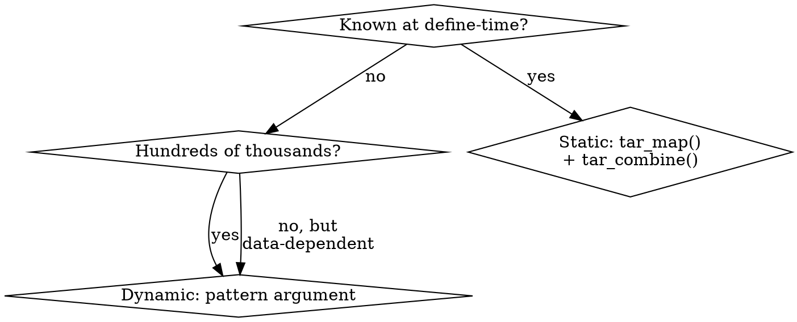

# Branching in targets Pipelines

Branching creates multiple targets from a single definition. Use **static branching** when iterations are known at define-time; use **dynamic branching** when determined at runtime.

## Quick Reference

| Need | Function | Key Syntax |
|------|----------|------------|
| Variants from parameters | `tar_map()` | `values = tibble(method = syms(...))` |
| Aggregate mapped targets | `tar_combine()` | `command = bind_rows(!!!.x)` |
| Runtime iteration | `tar_target(..., pattern = map(x))` | Pattern references *target names* |
| Batched replication | `tar_rep()` | `batches = 10, reps = 100` |
| Static + batched | `tar_map_rep()` | Combines `values` with `batches`/`reps` |
| Row group branching | `tar_group_by()` | Downstream uses `pattern = map()` |
| All combinations | `pattern = cross(x, y)` | Cartesian product |
| Test patterns | `tar_pattern()` | Before running pipeline |

## Choosing Static vs Dynamic



| Aspect | Static | Dynamic |
|--------|--------|---------|
| When defined | Before `tar_make()` | During `tar_make()` |
| Target names | Friendly (e.g., `analysis_bayesian`) | Cryptic (e.g., `analysis_3a7f2b`) |
| Scale | <1000 targets | 100k+ targets |
| Requires | `tarchetypes`, basic metaprogramming | Just `targets` |
| Validation | `tar_manifest()` shows all targets | Must run to see branches |

## Static Branching

Use `tar_map()` to create target variants from a values data frame. See [static-branching.md](static-branching.md) for full details.

### Building the values Data Frame

```r
library(tarchetypes)
library(tibble)
library(rlang)

# Simple: one row per variant
values <- tibble(
  method = syms(c("method_bayesian", "method_freq")),  # Functions as symbols
  method_name = c("bayesian", "freq")                   # Strings for names
)

# All combinations: use tidyr::expand_grid THEN apply syms()
library(tidyr)
params <- expand_grid(
  method_name = c("bayesian", "freq"),
  dataset = c("train", "test")
)
# Add function symbols separately (syms doesn't expand in grid)
params$method <- syms(paste0("method_", params$method_name))
```

**Critical:** `syms()` returns a list of symbols. Use it directly in `tibble()`, not inside `expand_grid()`.

### Using tar_map()

```r
tar_map(
  values = values,
  names = "method_name",  # Column(s) for target name suffixes
  tar_target(analysis, method(load_data(dataset))),
  tar_target(summary, summarize(analysis))
)
```

Aggregate with `tar_combine()`:

```r
mapped <- tar_map(
  unlist = FALSE,  # Required for selective combining
  values = values,
  tar_target(result, analyze(data))
)

tar_combine(
  all_results,
  mapped[["result"]],
  command = dplyr::bind_rows(!!!.x, .id = "method")
)
```

## Dynamic Branching

Use `pattern` argument for runtime-determined branches. See [dynamic-branching.md](dynamic-branching.md) for full details.

```r
list(
  tar_target(datasets, c("trial_A", "trial_B", "trial_C")),
  tar_target(
    analysis,
    analyze_data(datasets),
    pattern = map(datasets)  # One branch per element
  )
)
```

**Patterns:**
- `map(x, y)` - parallel iteration (zip)
- `cross(x, y)` - all combinations (cartesian)
- `slice(x, index = c(1, 3))` - specific elements
- `head(x, n = 5)` / `tail()` / `sample()` - subsets

**Iteration modes:**
- `"vector"` (default) - uses `vctrs::vec_slice()` / `vec_c()`
- `"list"` - uses `[[` / `list()` (for ggplot objects, etc.)
- `"group"` - branches over row groups

## Batching for Performance

For >1000 branches, batch to reduce overhead:

```r
# tar_rep: batched replication for simulation
tar_rep(
  sim_result,
  simulate_once(),
  batches = 10,   # 10 dynamic branches
  reps = 100      # 100 reps per batch = 1000 total
)

# tar_map_rep: static variants + batched replication
tar_map_rep(
  sim_result,
  simulate_once(method),
  values = tibble(method = syms(c("method_A", "method_B"))),
  batches = 10,
  reps = 100
)
```

## Complete Example: Multi-Dataset Analysis

5 datasets × 3 methods × 100 bootstrap replications:

```r
# _targets.R
library(targets)
library(tarchetypes)
library(tibble)
library(tidyr)
library(rlang)
library(dplyr)

# Define parameter grid
# Use expand_grid for all combinations, syms() for function names
values <- expand_grid(
  method = syms(c("method_bayesian", "method_freq", "method_bootstrap")),
  method_name = c("bayesian", "freq", "bootstrap"),
  dataset = c("trial_A", "trial_B", "obs_1", "obs_2", "registry")
) |>
  # Keep only matching method/method_name pairs, then cross with datasets
  distinct(method, method_name) |>
  cross_join(tibble(dataset = c("trial_A", "trial_B", "obs_1", "obs_2", "registry")))

# Simpler: build values correctly
values <- tibble(
  method = syms(c("method_bayesian", "method_freq", "method_bootstrap")),
  method_name = c("bayesian", "freq", "bootstrap")
)
datasets <- c("trial_A", "trial_B", "obs_1", "obs_2", "registry")

list(
  # Load datasets (static branching over known datasets)
  tar_map(
    values = tibble(dataset = datasets),
    tar_target(data, load_dataset(dataset))
  ),

  # tar_map_rep: static over methods × batched bootstrap reps
  # Each method runs on all datasets within each rep
  tar_map_rep(
    name = result,
    command = {
      # Process all datasets with this method
      purrr::map_dfr(datasets, function(d) {
        dat <- tar_read_raw(paste0("data_", d))
        out <- method(dat)
        out$dataset <- d
        out
      })
    },
    values = values,
    names = "method_name",
    batches = 10,
    reps = 10  # 10 batches × 10 reps = 100 total
  ),

  # Combine results from all methods
  # tar_map_rep creates result_bayesian, result_freq, result_bootstrap
  tar_target(
    final_summary,
    {
      method_names <- c("bayesian", "freq", "bootstrap")
      purrr::map_dfr(method_names, function(m) {
        tar_read_raw(paste0("result_", m))
      }) |>
        group_by(method, dataset) |>
        summarize(
          n_reps = n(),
          mean_est = mean(estimate),
          ci_lower = quantile(estimate, 0.025),
          ci_upper = quantile(estimate, 0.975),
          .groups = "drop"
        )
    }
  )
)
```

**Why this structure:**
- **Static branching** for methods (known at define-time, need friendly names)
- **tar_map_rep** for batched bootstrap (100 reps in 10 batches = efficient)
- **Final aggregation** reads all method results and summarizes

## Common Mistakes

| Mistake | Problem | Fix |
|---------|---------|-----|
| `pattern = map(external_df$col)` | Can't reference external objects in pattern | Create upstream target, reference by name |
| `method = c("func_a", "func_b")` | Strings aren't callable | Use `rlang::syms()` for function names |
| Manual `lapply` + `bind_rows` | Reinventing batching | Use `tar_rep()` or `tar_map_rep()` |
| Missing `unlist = FALSE` | Can't selectively combine | Add when using `tar_combine()` with `tar_map()` |
| `tar_make()` without validation | Errors discovered late | Always `tar_manifest()` first |

## Validation Checklist

**Before `tar_make()`:**

1. `tar_manifest()` - verify commands and target count
2. `tar_visnetwork(targets_only = TRUE)` - check dependency graph
3. `tar_pattern()` - test pattern logic with mock sizes

```r
# Test pattern structure before running
tar_pattern(
  cross(method, map(dataset, seed)),
  method = 3,
  dataset = 5,
  seed = 10
)
```

## See Also

- [static-branching.md](static-branching.md) - Detailed static branching guide
- [dynamic-branching.md](dynamic-branching.md) - Detailed dynamic branching guide
- **r-metaprogramming** skill - Expression manipulation with rlang
- **creating-targetopia-packages** skill - Building target factories
